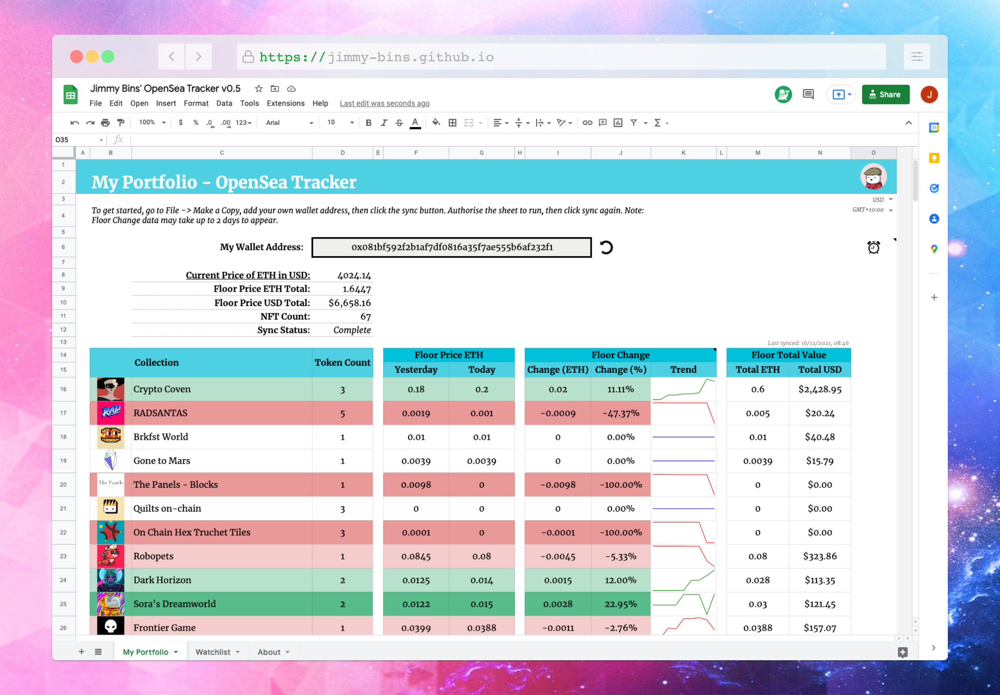

# About me

👋 Hi, I’m @JimmyBins! 👋

📫  You can find me at [@JimmyBins](https://twitter.com/JimmyBins) on Twitter. 📫

🎁 You can support development of these tools by visiting my [tip jar](https://jimmy-bins.io/tipjar).

---

# Projects

A list of my current work.

## OpenSea Portfolio - Floor Prices (Google Sheet)

Access here: [OpenSea Portfolio - Floor Prices (Google Sheet)](https://docs.google.com/spreadsheets/d/1gRqTrFS0BR6LTgnn8lv_baqEqUIOYhe2avEZ47QLj60/edit?usp=sharing)

This Google Sheet is a good way to get a ballpark estimate of your current NFT portfolio. You add your wallet address and it fetches the current price of ETH, the public items in your wallet & current floor prices on OpenSea, then gives you a total value. 

